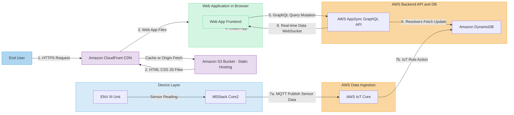

```mermaid
graph LR
    %% --- User Access & Content Delivery ---
    User[End User] -->|"1. HTTPS Request"| CloudFront["Amazon CloudFront CDN"];
    CloudFront -- "Cache or Origin Fetch" --> S3["Amazon S3 Bucket - Static Hosting"];
    S3 -- "2. HTML CSS JS Files" --> CloudFront;
    CloudFront -- "3. Web App Files" --> WebAppBrowser["User Browser"];

    %% --- Web Application Running in Browser ---
    subgraph WebAppBrowser ["Web Application in Browser"]
        WebAppClient["Web App Frontend"];
    end
    WebAppBrowser -- "4. Loads App" --> WebAppClient;

    %% --- Real-time Data API Interaction ---
    WebAppClient -- "5. GraphQL Query Mutation" --> AppSync["AWS AppSync GraphQL API"];
    AppSync -- "8. Real-time Data WebSocket" --> WebAppClient;

    %% --- Backend API and Database ---
    subgraph AWS_Backend_API ["AWS Backend API and DB"]
       direction TB
       AppSync -- "6. Resolvers Fetch Update" --> DynamoDB["Amazon DynamoDB"];
    end

    %% --- Data Ingestion Pipeline ---
    subgraph AWS_Ingestion ["AWS Data Ingestion"]
       direction TB
       IoTCore["AWS IoT Core"] -- "7b. IoT Rule Action" --> DynamoDB;
    end

    %% --- Device Layer ---
    subgraph Device ["Device Layer"]
       direction LR
       M5["M5Stack Core2"] -- "7a. MQTT Publish Sensor Data" --> IoTCore;
       ENV3["ENV III Unit"] -- "Sensor Reading" --> M5;
    end

    %% --- Styling Optional ---
    style User fill:#AED6F1,stroke:#3498DB
    style CloudFront fill:#E8DAEF,stroke:#8E44AD
    style S3 fill:#E8DAEF,stroke:#8E44AD
    style WebAppBrowser fill:#D5F5E3,stroke:#58D68D
    style WebAppClient fill:#D5F5E3,stroke:#58D68D
    style AWS_Backend_API fill:#FAD7A0,stroke:#F39C12
    style AWS_Ingestion fill:#FAD7A0,stroke:#F39C12
    style Device fill:#D6EAF8,stroke:#5DADE2
```